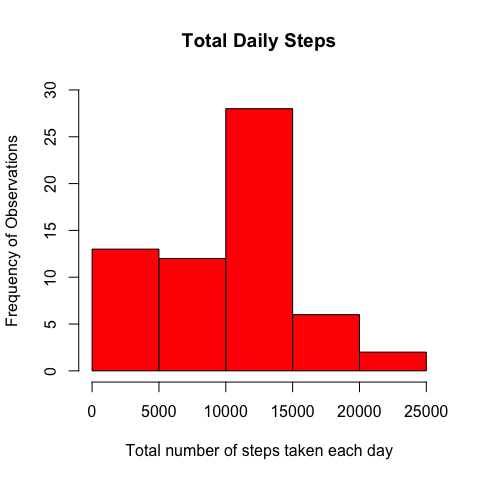
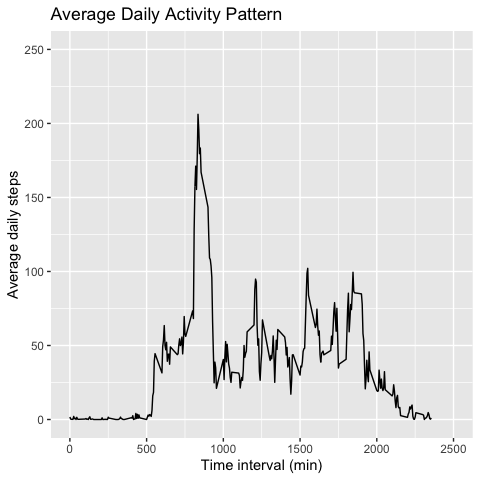
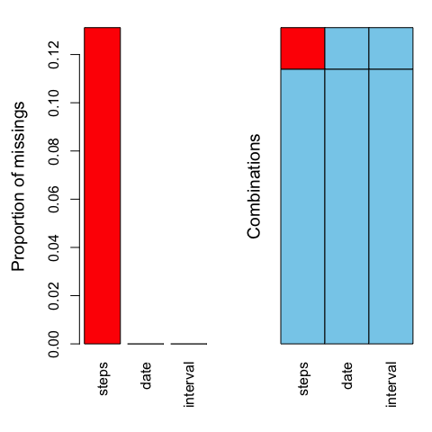
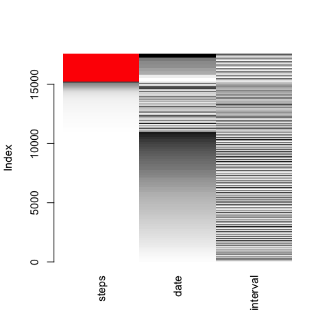
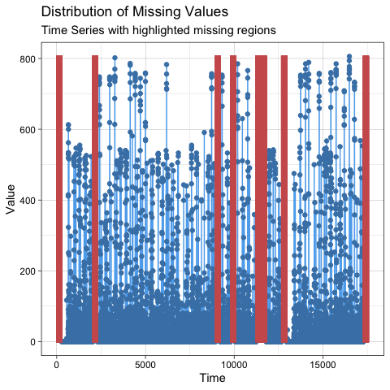
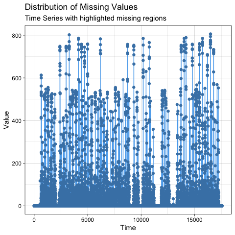
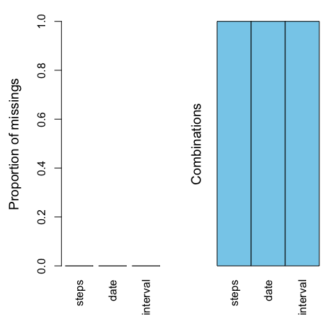
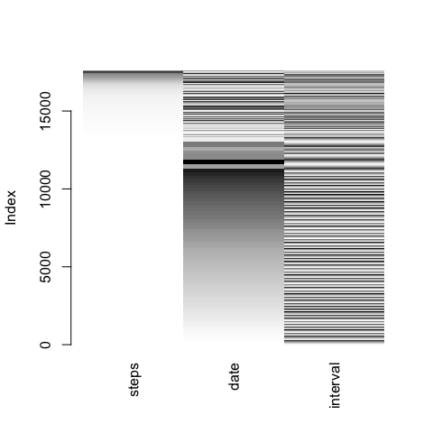
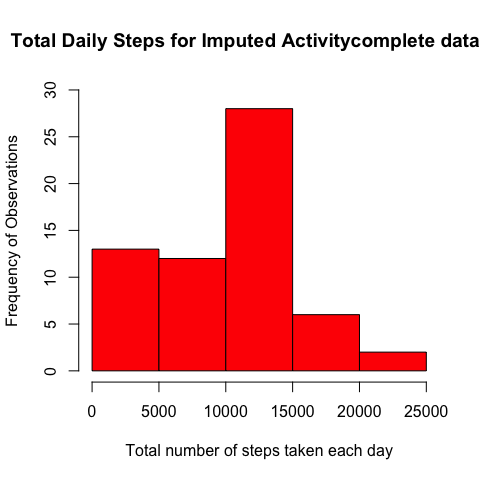
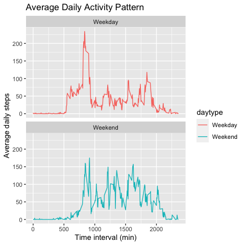

Reproducible Research Course_Week 2_Project 1
============================================================================
Abdul Bari Muhammad

## Introduction

This repository contains code to address questions for the project-1 assigned during week-2 of the *Reproducible Research course* from Johns Hopkins on Coursera. The data for this assignment can be downloaded from the website link below:

**Dataset Link:**
https://d396qusza40orc.cloudfront.net/repdata%2Fdata%2Factivity.zip

### Assignment:

Write a report that answers the questions below:

1. Code for reading in the dataset and/or processing the data
2. Histogram of the total number of steps taken each day
3. Mean and median number of steps taken each day
4. Time series plot of the average number of steps taken
5. The 5-minute interval that, on average, contains the maximum number of steps
6. Code to describe and show a strategy for imputing missing data
7. Number of steps taken each day after missing values are imputed
    + 7a. Histogram of the total number of steps taken each day after missing values are imputed
    + 7b. Mean and median of total number of steps taken per day after missing values are imputed.
8. Panel plot comparing the average number of steps taken per 5-minute interval across weekdays and weekends
9. All of the R code needed to reproduce the results (numbers, plots, etc.) in the report

**Setting global options for markdown**

```r
library(knitr)
opts_chunk$set(echo = TRUE, results = "asis", fig.show = "asis", fig.dim = c(5,5), message = FALSE, warning = FALSE, fig.path = "figures/", dev = "png")
```

## 1. Loading and preprocessing the data


```r
# Download data file, unzip, and read the "activity.csv" file

path <- getwd()
url <- "https://d396qusza40orc.cloudfront.net/repdata%2Fdata%2Factivity.zip"
download.file(url, file.path(path, "ActivityData.zip"))
unzip("ActivityData.zip")

# Load packages
library(data.table)

# Read "activity.csv" file
Activity <- data.table::fread("activity.csv")
```

## 2. Histogram of the total number of steps taken each day


```r
# Load packages

library(data.table)
library(dplyr)

# Group by date and summarize for daily total steps

Activity <- data.table::fread("activity.csv")
kable(head(Activity), format = "markdown", caption = "Original Activity Data")
```


Table: Original Activity Data

| steps|date       | interval|
|-----:|:----------|--------:|
|    NA|2012-10-01 |        0|
|    NA|2012-10-01 |        5|
|    NA|2012-10-01 |       10|
|    NA|2012-10-01 |       15|
|    NA|2012-10-01 |       20|
|    NA|2012-10-01 |       25|

```r
DailyActivity <- group_by(Activity, date)
DailyActivity <- summarize(DailyActivity, Dailysum = sum(steps, na.rm = TRUE))
kable(head(DailyActivity), format = "markdown", caption = "Total daily steps grouped by date")
```


Table: Total daily steps grouped by date

|date       | Dailysum|
|:----------|--------:|
|2012-10-01 |        0|
|2012-10-02 |      126|
|2012-10-03 |    11352|
|2012-10-04 |    12116|
|2012-10-05 |    13294|
|2012-10-06 |    15420|

```r
# Plot histogram of DailyTotalSteps

hist(DailyActivity$Dailysum,
	col = "red", main = "Total Daily Steps",
	xlab = "Total number of steps taken each day",
	ylab = "Frequency of Observations",
	ylim = c(0, 30))
```

<!-- -->

```r
dev.off()
```

null device 
          1 

## 3. Mean and median number of steps taken each day


```r
# Load packages

library(data.table)
library(dplyr)

# Read "activity.csv" file
# Group by date and summarize for daily total steps
# Compute mean and median daily total steps

Activity <- data.table::fread("activity.csv")
DailyActivity <- group_by(Activity, date)
DailyActivity <- summarize(DailyActivity, Dailysum = sum(steps, na.rm = TRUE))
kable(head(DailyActivity), format = "markdown", caption = "Total daily steps grouped by date")
```


Table: Total daily steps grouped by date

|date       | Dailysum|
|:----------|--------:|
|2012-10-01 |        0|
|2012-10-02 |      126|
|2012-10-03 |    11352|
|2012-10-04 |    12116|
|2012-10-05 |    13294|
|2012-10-06 |    15420|

```r
Meandaily <- mean(DailyActivity$Dailysum)
Mediandaily <- median(DailyActivity$Dailysum)
MeanMedian <- data.table(Meandaily, Mediandaily)
kable(MeanMedian, format = "markdown",
        caption = "The mean and median number of steps taken daily")
```


Table: The mean and median number of steps taken daily

| Meandaily| Mediandaily|
|---------:|-----------:|
|   9354.23|       10395|

-*The mean and median number of steps taken daily are 9354.2295082 and 10395, respectively*

## 4. Time series plot of the average number of steps taken


```r
# Load packages

library(data.table)
library(dplyr)
library(ggplot2)

# Read "activity.csv" file
# Group by interval and summarize for Average steps per interval

Activity <- data.table::fread("activity.csv")
IntervalActivity <- group_by(Activity, interval)
Averagepattern <- summarize(IntervalActivity, Avgsteps = mean(steps, na.rm= TRUE))
kable(head(Averagepattern), format = "markdown", caption = "Mean steps grouped by interval")
```


Table: Mean steps grouped by interval

| interval|  Avgsteps|
|--------:|---------:|
|        0| 1.7169811|
|        5| 0.3396226|
|       10| 0.1320755|
|       15| 0.1509434|
|       20| 0.0754717|
|       25| 2.0943396|

```r
# Time series plot of average number of steps taken vs Time Interval

qplot(interval, Avgsteps, data = Averagepattern,
	geom = "line",
	main = "Average Daily Activity Pattern",
	xlab= "Time interval (min)", ylab = "Average daily steps",
	xlim = c(0, 2500), ylim = c(0,250))
```

<!-- -->

```r
dev.off()
```

null device 
          1 

## 5. The 5-minute interval that, on average, contains the maximum number of steps


```r
# 5-min interval that contains the maximum number of steps

Maxstepinterval <- filter(Averagepattern, Avgsteps == max(Avgsteps))
Maxstepinterval$interval
```

[1] 835

-**The 5-min interval that contains the maximum number of steps is 835**

## 6. Code to describe and show a strategy for imputing missing data

- *summary(Activity) indicates that there are 2304 missing values from steps*
- *aggr plot indicates that 2304 (13%) of 17568 values for steps are missing*
- *matrixplot indicates values are missing from earlier dates*
- *statsNA(Activity$steps) gives stats of missing values*
- *ggplot_na_distribution() marks the missing values at specific missing intervals*
- *Activitycomplete data set created by imputing values to missing values using imputeTS::na_kalman method*
- *Run confirmatory statistics to ensure proper imputation*


```r
# Load packages

library(data.table)
library(dplyr)
library(VIM)
library(imputeTS)
library(ggplot2)

# Read "activity.csv" file
# Identify and visualize missing values

Activity <- data.table::fread("activity.csv")
kable(summary(Activity), format = "markdown", caption = "Summary statistics of original data showing missing values for steps")
```


Table: Summary statistics of original data showing missing values for steps

|   |    steps      |     date          |   interval    |
|:--|:--------------|:------------------|:--------------|
|   |Min.   :  0.00 |Min.   :2012-10-01 |Min.   :   0.0 |
|   |1st Qu.:  0.00 |1st Qu.:2012-10-16 |1st Qu.: 588.8 |
|   |Median :  0.00 |Median :2012-10-31 |Median :1177.5 |
|   |Mean   : 37.38 |Mean   :2012-10-31 |Mean   :1177.5 |
|   |3rd Qu.: 12.00 |3rd Qu.:2012-11-15 |3rd Qu.:1766.2 |
|   |Max.   :806.00 |Max.   :2012-11-30 |Max.   :2355.0 |
|   |NA's   :2304   |NA                 |NA             |

```r
aggr(Activity, number = TRUE, sortVars = TRUE, varheight = TRUE)
```

<!-- -->
 Variables sorted by number of missings: 
 Variable     Count
    steps 0.1311475
     date 0.0000000
 interval 0.0000000

```r
matrixplot(Activity, sortby = (c("steps")))
```

<!-- -->
Click in a column to sort by the corresponding variable.
To regain use of the VIM GUI and the R console, click outside the plot region.

```r
statsNAoriginal <- statsNA(Activity$steps)
```

[1] "Length of time series:"
[1] 17568
[1] "-------------------------"
[1] "Number of Missing Values:"
[1] 2304
[1] "-------------------------"
[1] "Percentage of Missing Values:"
[1] "13.1%"
[1] "-------------------------"
[1] "Number of Gaps:"
[1] 7
[1] "-------------------------"
[1] "Average Gap Size:"
[1] 329.1429
[1] "-------------------------"
[1] "Stats for Bins"
[1] "  Bin 1 (4392 values from 1 to 4392) :      576 NAs (13.1%)"
[1] "  Bin 2 (4392 values from 4393 to 8784) :      0 NAs (0%)"
[1] "  Bin 3 (4392 values from 8785 to 13176) :      1440 NAs (32.8%)"
[1] "  Bin 4 (4392 values from 13177 to 17568) :      288 NAs (6.56%)"
[1] "-------------------------"
[1] "Longest NA gap (series of consecutive NAs)"
[1] "576 in a row"
[1] "-------------------------"
[1] "Most frequent gap size (series of consecutive NA series)"
[1] "288 NA in a row (occuring 6 times)"
[1] "-------------------------"
[1] "Gap size accounting for most NAs"
[1] "288 NA in a row (occuring 6 times, making up for overall 1728 NAs)"
[1] "-------------------------"
[1] "Overview NA series"
[1] "  288 NA in a row: 6 times"
[1] "  576 NA in a row: 1 times"

```r
ggplot_na_distribution(Activity$steps)
```

<!-- -->

```r
# Imputing missing values and rerun summary and stats

Activitycomplete <- na_kalman(Activity)
kable(summary(Activitycomplete), format = "markdown", caption = "Summary statistics of Imputed data showing NO missing values for steps")
```


Table: Summary statistics of Imputed data showing NO missing values for steps

|   |    steps        |     date          |   interval    |
|:--|:----------------|:------------------|:--------------|
|   |Min.   :  0.0000 |Min.   :2012-10-01 |Min.   :   0.0 |
|   |1st Qu.:  0.0000 |1st Qu.:2012-10-16 |1st Qu.: 588.8 |
|   |Median :  0.0000 |Median :2012-10-31 |Median :1177.5 |
|   |Mean   : 32.4801 |Mean   :2012-10-31 |Mean   :1177.5 |
|   |3rd Qu.:  0.0063 |3rd Qu.:2012-11-15 |3rd Qu.:1766.2 |
|   |Max.   :806.0000 |Max.   :2012-11-30 |Max.   :2355.0 |

```r
statsNAcomplete <- statsNA(Activitycomplete$steps)
```

[1] "Length of time series:"
[1] 17568
[1] "-------------------------"
[1] "Number of Missing Values:"
[1] 0
[1] "-------------------------"
[1] "Percentage of Missing Values:"
[1] "0%"
[1] "-------------------------"
[1] "Number of Gaps:"
[1] 0
[1] "-------------------------"
[1] "Average Gap Size:"
[1] 0
[1] "-------------------------"
[1] "No NAs in the time series."
[1] "-------------------------"

```r
ggplot_na_distribution(Activitycomplete$steps)
```

<!-- -->

```r
aggr(Activitycomplete, number = TRUE, sortVars = TRUE, varheight = TRUE)
```

<!-- -->
 Variables sorted by number of missings: 
 Variable Count
    steps     0
     date     0
 interval     0

```r
matrixplot(Activitycomplete, sortby = (c("steps")))
```

<!-- -->
Click in a column to sort by the corresponding variable.
To regain use of the VIM GUI and the R console, click outside the plot region.

## 7. Number of steps taken each day after missing values are imputed

#### + 7a. Histogram of the total number of steps taken each day after missing values are imputed


```r
# Group by date and summarize for daily total steps for imputed Activitycomplete dataset

DailyActivitycomplete <- group_by(Activitycomplete, date)
DailyActivitycomplete <- summarize(DailyActivitycomplete, Dailysumcomplete = sum(steps, na.rm = TRUE))

# Plot histogram of DailyTotalSteps for Activitycomplete dataset

hist(DailyActivitycomplete$Dailysumcomplete,
	col = "red", main = "Total Daily Steps for Imputed Activitycomplete dataset",
	xlab = "Total number of steps taken each day",
	ylab = "Frequency of Observations",
	ylim = c(0, 30))
```

<!-- -->

```r
dev.off()
```

null device 
          1 

#### + 7b. Mean and median of total number of steps taken per day after missing values are imputed.


```r
# Compute mean and median daily total steps for Activitycomplete dataset

DailyActivitycomplete <- group_by(Activitycomplete, date)
DailyActivitycomplete <- summarize(DailyActivitycomplete, Dailysumcomplete = sum(steps, na.rm = TRUE))
Meandailycomplete <- mean(DailyActivitycomplete$Dailysumcomplete)
Mediandailycomplete <- median(DailyActivitycomplete$Dailysumcomplete)
MeanMediancomplete <- data.table(Meandailycomplete, Mediandailycomplete)
kable(MeanMediancomplete, format = "markdown",
        caption = "The mean and median number of steps taken daily for the complete datset after imputation")
```


Table: The mean and median number of steps taken daily for the complete datset after imputation

| Meandailycomplete| Mediandailycomplete|
|-----------------:|-------------------:|
|          9354.259|               10395|

- **The mean and median number of steps taken daily after imputing values to missing data are 9354.2586892 and 1.0395\times 10^{4}, respectively**

- *Since values were imputed using the Kalman Smoothing method, no particular differences were noted in the mean and median number of steps taken daily.*

## 8. Panel plot comparing the average number of steps taken per 5-minute interval across weekdays and weekends


```r
# Load packages

library(data.table)
library(dplyr)
library(lubridate)
library(stringr)
library(ggplot2)

# Read "activity.csv" file
# Mutate to add day factor and daytype factor
# Aggregate values for average daily activity across days for particular time-interval

Activity <- data.table::fread("activity.csv")
Activityday <- mutate(Activity, day = weekdays(date))
Activityday <- mutate(Activityday, daytype = 
			if_else(str_detect(day, "Saturday|Sunday") == TRUE,
				 "Weekend", "Weekday"))
kable(head(Activityday), format = "markdown", caption = "Table showing mutated Activity dataset with day name and day type")
```


Table: Table showing mutated Activity dataset with day name and day type

| steps|date       | interval|day    |daytype |
|-----:|:----------|--------:|:------|:-------|
|    NA|2012-10-01 |        0|Monday |Weekday |
|    NA|2012-10-01 |        5|Monday |Weekday |
|    NA|2012-10-01 |       10|Monday |Weekday |
|    NA|2012-10-01 |       15|Monday |Weekday |
|    NA|2012-10-01 |       20|Monday |Weekday |
|    NA|2012-10-01 |       25|Monday |Weekday |

```r
Averagepattern <- aggregate(steps ~ interval + daytype, Activityday, mean, na.rm= TRUE)
kable(head(Averagepattern), format = "markdown", caption = "Mean steps grouped by interval and daytype")
```


Table: Mean steps grouped by interval and daytype

| interval|daytype |     steps|
|--------:|:-------|---------:|
|        0|Weekday | 2.3333333|
|        5|Weekday | 0.4615385|
|       10|Weekday | 0.1794872|
|       15|Weekday | 0.2051282|
|       20|Weekday | 0.1025641|
|       25|Weekday | 1.5128205|

```r
# Facet plot of x= "Time interval (min)", y= "Average daily steps"

ggplot(Averagepattern, aes(interval, steps)) + 
geom_line(aes(color = daytype)) + 
facet_wrap(vars(daytype), nrow=2) + 
ggtitle ("Average Daily Activity Pattern") + 
labs(x= "Time interval (min)", y= "Average daily steps")
```

<!-- -->

```r
dev.off()
```

null device 
          1 


*End of Document*
